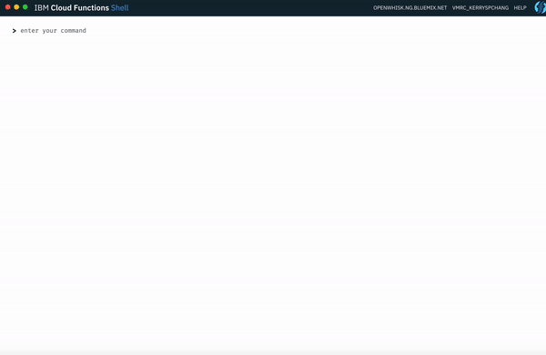

[](https://travis-ci.org/ibm-functions/shell)
[](http://www.apache.org/licenses/LICENSE-2.0)
[](http://slack.openwhisk.org/)
[](https://codecov.io/gh/ibm-functions/shell)
[](http://hits.dwyl.io/ibm-functions/shell)

# IBM Cloud Functions Shell

Welcome to a new development experience for IBM Cloud Functions. Cloud Functions Shell (or just _Shell_) is an [Electron](https://electronjs.org/) desktop application that combines a command-line interface (CLI) and a graphical user interface (GUI): 

* Developers interact with the cloud mainly through execute textual commands, as in a conventional CLI. The command-line style of interaction enables quick task switching without clicking through various links and allows task automation through scripting. 
* Unlike conventional CLIs, in Shell, data returned from the cloud are carefully rendered into prettified code, tables and visualizations to assist users in various tasks. Mouse interactions are added to avoid copying lengthy text or IDs. Shell also integrates some common graphical tools such as a debugger for inspecting parameters and inserting breakpoints, and an light-weight text editor that offers real-time syntax highlighting. 

As a local desktop application, Shell is fast and is designed for productive use, and can access local storage to provide new features like interacting with other editors and debugging a function in a local container. 

## Installing Shell
Shell is currently distributed through the [Node.js package manager (NPM)](https://www.npmjs.com/package/@ibm-functions/shell). We recommend that you install the shell globally (`npm install -g`): 

```
$ npm install -g @ibm-functions/shell
```

If you are an existing `wsk` or `bx wsk` CLI user, you should be able to start using Shell right away with the host and credential specified in `$HOME/.wskprops`. If you have never installed `bx wsk` or `wsk` CLI before, follow the instructions in the [install and troubleshooting page](docs/npm.md#using-shell-with-ibm-cloud-functions-or-apache-openwhisk) to set up your environment. 

## Starting Shell 

```
$ fsh shell
```

`fsh` is a shorthand for "function shell". You will see a new window popped up. Welcome to Shell! 

_Tip_: You can pin Shell's icon to the desktop for quick access. For example, in MacOS, you can right click on the blue Shell icon and select `Options > Keep in Dock`. Next time you can click on that icon to start Shell from the dock. 

## Interface Overview

||
|:--:|
|Working in Shell|

Shell has a CLI and a _sidecar_ that can be opened and closed on demand. Contents that need more space such as JSON data or visualizations are usually shown in the sidecar, whereas execution messages and lists are shown under the corresponding command. 

## Learning Shell 

* Basic cloud function commands (TODO)
* Run Shell commands in the Electron app vs. directly from the terminal (TODO)
* [Programming Serverless Composition with Composer and Shell](https://github.com/ibm-functions/composer/blob/master/docs/tutorials/introduction/README.md) 
* Tour of Shell's visualizations (TODO)
* [Shell's YouTube channel](https://www.youtube.com/channel/UCcu16nIMNclSujJWDOgUI_g) for demo videos 

## Developing Shell together

Contributions are welcome. Please join in [developing and extending the Shell code](docs/dev/README.md).


